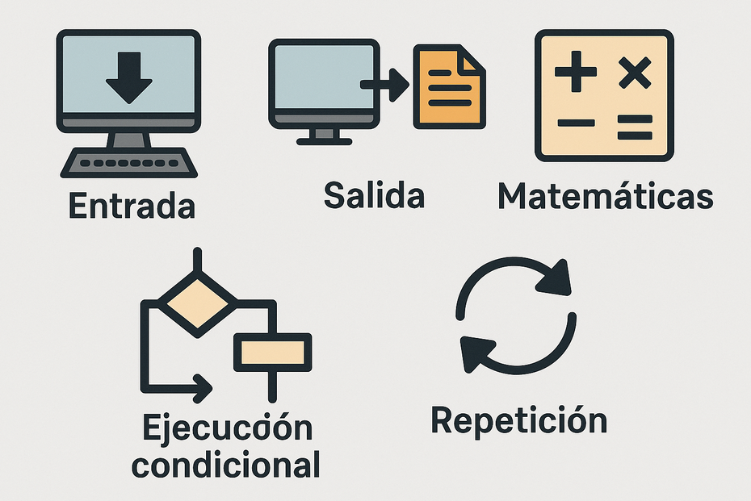
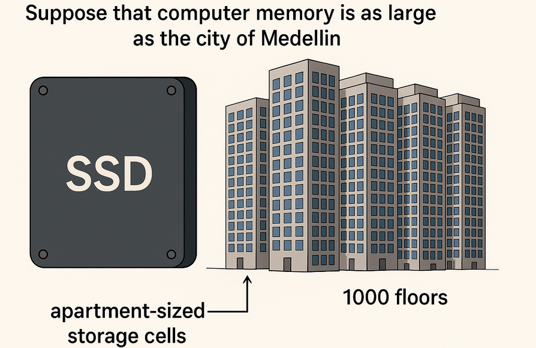
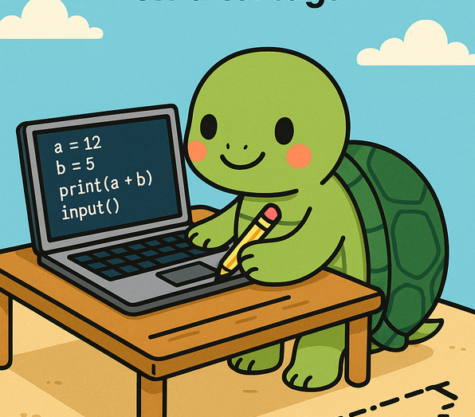
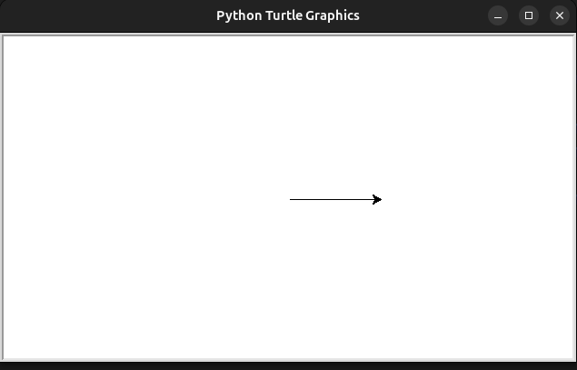
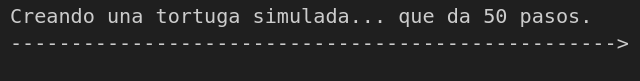
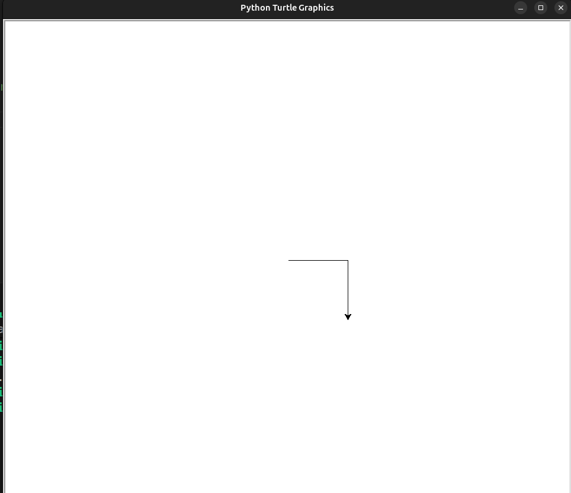

# Unidad 1

Bienvenido a la primera unidad de tu curso en *Pensamiento Algorítmico*. En esta unidad comenzaremos estudiando las variables y las principales estructuras de datos en Python.
## El Hardware

Sección en construcción. Para entender cómo funciona el hardware, te invito a que veas el siguiente video:

<iframe width="560" height="315" src="https://www.youtube.com/embed/QZwneRb-zqA" frameborder="0" allowfullscreen></iframe>

Una vez veas el video anterior, es bueno echar un vistazo a la forma moderna de estas tecnologías. Para esto, te invito a ver este video donde se recrea la estructura microscópica de una memoria SSD moderna:
<iframe width="560" height="315"
  src="https://www.youtube.com/embed/5Mh3o886qpg?start=51"
  title="Video de YouTube"
  frameborder="0"
  allow="accelerometer; autoplay; clipboard-write; encrypted-media; gyroscope; picture-in-picture; web-share"
  allowfullscreen>
</iframe>

## Software

La conexión entre software y hardware puede ser entendida a partir del siguiente video:

<iframe width="560" height="315" src="https://www.youtube.com/embed/HjneAhCy2N4" frameborder="0" allowfullscreen></iframe>


## Los Lenguajes de Programación

En este curso usaremos Python como nuestra puerta de entrada al mundo de la programación. Sin embargo, Python es solo uno de los posibles lenguajes en los que podemos dar instrucciones a los computadores. Python forma parte de lo que conocemos como lenguajes formales.

Los lenguajes formales aparecen en áreas como las matemáticas. Por ejemplo, la expresión $( \int f(x) \, dx = U $) tiene un significado preciso y una sintaxis y unos símbolos "tokens" particulares. En particular, un lenguaje de programación 
*es un lenguaje formal diseñado para expresar computaciones*

Por su parte, los lenguajes naturales, como el español o el francés, son creaciones culturales que reflejan en parte la complejidad de la experiencia humana. Por tanto, tienen la capacidad de expresar muchas cosas de manera ambigua, redundante, con doble sentido, chistes, poesía, etc.

!!! admonition "Consulta más detalles"
    Puedes consultar la referencia para más detalles: [The Way of the Program](https://openbookproject.net/thinkcs/python/english3e/way_of_the_program.html).

Hoy en día, los modelos de lenguaje LLM en los que se basan los sistemas de inteligencia artificial más populares están haciendo posible que creemos instrucciones para los computadores en lenguaje natural. Pero esto no significa que aprender a hablar en Python y similares no sea importante. Primero, es la herramienta que te permitirá pensar computacionalmente, y segundo, el paradigma que se impone es una mezcla de los dos lenguajes. Construiremos código para ciertas instrucciones y veremos que en otras partes será más apropiado crear la instrucción en lenguaje natural.

La buena noticia es que aprender un lenguaje de programación resulta más fácil que aprender francés o español. De hecho, un lenguaje de programación y toda la magia que se deriva de ellos, como el internet y el machine learning, se basa en los siguientes elementos básicos:



- **Entrada:** Obtener datos desde el teclado, un archivo u otro dispositivo.
- **Salida:** Mostrar datos en la pantalla o enviar datos a un archivo u otro dispositivo.
- **Matemáticas:** Realizar operaciones matemáticas básicas como la suma y la multiplicación.
- **Ejecución condicional:** Verificar ciertas condiciones y ejecutar la secuencia de instrucciones apropiada.
- **Repetición:** Realizar una acción repetidamente, usualmente con alguna variación.

Créelo o no, eso es prácticamente todo. Cada programa que has usado, sin importar cuán complicado sea, está compuesto de instrucciones que se parecen más o menos a estas. Así, podemos describir la programación como el proceso de descomponer una tarea grande y compleja en subtareas cada vez más pequeñas hasta que las subtareas sean lo suficientemente simples como para ser realizadas con secuencias de estas instrucciones básicas.

Aunque esto puede parecer un poco vago, volveremos a este tema más adelante cuando hablemos de algoritmos. 

##  Variables, Valores y Operadores

Una **variable** es un nombre que usamos para hacer referencia a un valor que guardamos en la memoria del computador.  

Un **valor** es una **unidad de información** que puede ser almacenada y manipulada por un programa.  
Los valores pueden ser de distintos **tipos de datos**, como:

- **Números enteros (`int`)**: `3`, `-12`, `250`
- **Números decimales (`float`)**: `3.14`, `-0.001`, `2.5`
- **Cadenas de texto (`str`)**: `"Hola"`, `'Python'`
- **Valores lógicos (`bool`)**: `True`, `False`

Cada valor ocupa un espacio físico en la memoria del computador, y las variables sirven como etiquetas que nos permiten acceder a esos espacios fácilmente.

Supongamos que la memoria de un computador es tan grande como la ciudad de **Medellín**, que tiene aproximadamente **2.5 millones de habitantes** y una superficie de **380 km²**.  

Ahora bien, piensa en una unidad SSD (unidad de estado sólido) expandida hasta cubrir toda esa área. Si cada celda de memoria (trampa de electrones que almacena un bit) fuera del tamaño de un apartamento de 20 nm × 20 nm, y se construyeran 1000 pisos de estos apartamentos uno sobre otro (como edificios), esa “Medellín‑SSD” estaría completamente cubierta por edificios de memoria.

En total, una SSD de ese tamaño y configuración podría almacenar aproximadamente:

$$
30 \text{ trillones de trillones} = 2.97 \times 10^{25} \text{ enteros de 32 bits}
$$

Es decir, una ciudad poblada por más de 30 sextillones de “habitantes‑dato”, donde cada uno representa un valor almacenado en la memoria.
La cuestión es cómo llevar un registro de dónde viven las personas (valores, datos) que habitan una ciudad tan descomunalmente grande.


!!! admonition "Piensa en esto"
    ¿Cómo guardarías de manera eficiente un registro de dónde están almacenadas las cosas en la memoria?

Una idea sería, por ejemplo, tener una carpeta de sobres apilados en orden alfabético. Cada sobre tiene el nombre de la persona y dentro del sobre está la dirección. Entonces, por ejemplo, "don_juan" vive en Edificio Torre Malibú, Carrera 68 #32c-24, Int. 301.

En programación, esto se logra con el uso de variables. Por ejemplo, si hago:

```python
a = 3
```
El intérprete de Python asigna a un sector de la memoria la etiqueta "`a`" (similar a "`don_juan`" en el ejemplo anterior) y guarda en este sector de la memoria el valor `3`.  

Tres es un número entero, por lo tanto, el espacio de memoria (el apartamento) reservado para `a` debe ser lo suficientemente grande para albergar un **entero en binario**.  

En la mayoría de los sistemas modernos, los enteros se representan en **32 o 64 bits**, dependiendo de la arquitectura del procesador.  
Cada **bit** puede almacenar un valor de **0** o **1**, y en conjunto estos bits forman el valor binario.  
Por ejemplo, el número 3 en binario (de 8 bits para simplificar) se representa como:

$$
3_{10} = 00000011_2
$$

Cada bit tiene un peso asociado (potencia de 2):  

| Bit | Peso \(2^n\) | Valor |
|-----|---------------|--------|
| 7   | 128           | 0      |
| 6   | 64            | 0      |
| 5   | 32            | 0      |
| 4   | 16            | 0      |
| 3   | 8             | 0      |
| 2   | 4             | 0      |
| 1   | 2             | 1      |
| 0   | 1             | 1      |

La suma de los bits encendidos (1) nos da el valor decimal:

$$
2^1 + 2^0 = 3
$$

Podemos verificar que efectivamente se trata de un entero haciendo:

=== "Código"
    ```python
    a = 3
    type(a)
    ```

=== "Salida"
    ```bash
    <class 'int'>
    ```
Mientras que la **dirección en la memoria** donde se almacena el valor de la variable puede consultarse con la función `id()`:

=== "Código"
    ```python
    a = 3
    print(id(a))
    ```

=== "Salida"
    ```bash
    140356812509040
    ```

El número que devuelve `id(a)` representa una **dirección única** dentro de la memoria del programa (no necesariamente la dirección física del hardware).  
Cada vez que creamos una nueva variable o reasignamos un valor, Python puede ubicar ese valor en una posición diferente de memoria.  

Por ejemplo:

=== "Código"
    ```python
    a = 3
    b = 3
    c = 4
    print(id(a), id(b), id(c))
    ```

=== "Salida"
    ```bash
    140356812509040 140356812509040 140356812509072
    ```

Observa que `a` y `b` apuntan a la **misma dirección en memoria**, ya que Python optimiza el almacenamiento de valores inmutables (como los enteros pequeños) reutilizando el mismo espacio.  
En cambio, `c` tiene una dirección distinta porque contiene otro valor.

??? question "Si `a = 3` y `b = a`, ¿qué ocurre con la memoria?"
    Cuando escribimos:

    === "Código"
        ```python
        a = 3
        b = a
        print(id(a), id(b))
        ```

    === "Salida"
        ```bash
        140356812509040 140356812509040
        ```

    Tanto `a` como `b` **apuntan al mismo lugar en memoria**.  
    Esto ocurre porque los números enteros son **inmutables** en Python, y el intérprete optimiza el uso de memoria reutilizando la misma dirección para valores idénticos.

    Si luego modificamos `b`:

    === "Código"
        ```python
        b = 5
        print(id(a), id(b))
        ```

    === "Salida"
        ```bash
        140356812509040 140356812509120
        ```

    Ahora `b` apunta a una **nueva dirección en memoria**, ya que su valor cambió.  
    En consecuencia, `a` y `b` ya no hacen referencia a la misma variable.
### Operadores

Hemos introducido el concepto de **variable**, y al mismo tiempo vimos cómo guardar valores en ellas.  
En el proceso, sin notarlo, usamos el símbolo `=`, que es un **operador** llamado **operador de asignación**.

Un **operador** es un símbolo o palabra reservada que **indica una operación que el intérprete debe realizar** sobre uno o más valores.  
Por ejemplo, los operadores `+`, `-`, `*` y `/` realizan operaciones aritméticas, mientras que `=` asigna un valor a una variable.

El **operador de asignación** `=` **no compara igualdad**, sino que **toma el valor que está a la derecha y lo guarda en la variable de la izquierda**.

=== "Código"
    ```python
    a = 5
    b = a + 2
    print(a, b)
    ```

=== "Salida"
    ```bash
    5 7
    ```

En este ejemplo, el operador `=` le indica al intérprete que **asigne** el resultado de `a + 2` (es decir, 7) a la variable `b`.

---

En **matemáticas**, la expresión

$$
x = 3
$$

significa que *x es igual a 3*, es decir, una **igualdad** permanente y simétrica: si \(x = 3\), entonces \(3 = x\).

En **Python**, en cambio, la instrucción

```python
x = 3
```

Significa **“asigna el valor 3 a la variable `x`”**.  
La relación **no es simétrica**: puedes decir *“x toma el valor 3”*, pero no *“3 toma el valor de x”*.

Si quisiéramos comprobar **igualdad lógica** en Python, usamos el operador `==`, como se muestra a continuación:

=== "Código"
    ```python
    x = 3
    print(x == 3)
    print(3 == x)
    ```

=== "Salida"
    ```bash
    True
    True
    ```


El operador `==` **compara** los valores de ambos lados y devuelve `True` si son iguales, o `False` en caso contrario.

Es importante comprender esto porque, por ejemplo, podría parecer  poco intuitivo pensar que la expresión siguiente representa una **igualdad matemática**

=== "Código"
    ```python
    a = 3
    print(a)

    a = a + 1
    print(a)
    ```

=== "Salida"
    ```bash
    3
    4
    ```

En la primera línea, `a = 3` **asigna** el valor `3` a la variable `a`.  
En la instrucción `a = a + 1`, Python **toma el valor actual de `a` (3)**, **le suma 1**, y **guarda el resultado (4)** nuevamente en la misma variable.  
No significa que \( a = a + 1 \) sea una igualdad posible (como en matemáticas), sino una **instrucción secuencial**:  
> “Toma el valor de `a`, súmale 1, y guarda el nuevo valor en `a`”.

En el computador, como en un **ábaco**, siempre estamos **actualizando y moviendo valores en la memoria**.  
Cada operación implica **leer un valor**, **realizar un cálculo**, y luego **almacenar el resultado** nuevamente en algún lugar (generalmente, en la misma variable o en otra nueva).

Así, el computador actúa como un operador que mueve fichas en el ábaco, cambiando las posiciones para reflejar el nuevo estado de los datos en memoria.


Podemos observar cómo funcionan otros **operadores** en Python, usando distintas variables y operaciones básicas:

=== "Código"
    ```python
    # Operadores aritméticos
    x = 10
    y = 4

    print("Suma:", x + y)        # Operador de suma
    print("Resta:", x - y)       # Operador de resta
    print("Multiplicación:", x * y)  # Operador de multiplicación
    print("División:", x / y)    # División con resultado decimal
    print("División entera:", x // y) # División entera (sin decimales)
    print("Módulo:", x % y)      # Resto de la división
    print("Potencia:", x ** y)   # Exponente
    ```

=== "Salida"
    ```bash
    Suma: 14
    Resta: 6
    Multiplicación: 40
    División: 2.5
    División entera: 2
    Módulo: 2
    Potencia: 10000
    ```

---

También existen **operadores de comparación**, que permiten comparar valores y devuelven `True` o `False` según el resultado:

=== "Código"
    ```python
    a = 5
    b = 8

    print(a == b)  # ¿a es igual a b?
    print(a != b)  # ¿a es diferente de b?
    print(a > b)   # ¿a es mayor que b?
    print(a < b)   # ¿a es menor que b?
    print(a >= 5)  # ¿a es mayor o igual que 5?
    print(b <= 8)  # ¿b es menor o igual que 8?
    ```

=== "Salida"
    ```bash
    False
    True
    False
    True
    True
    True
    ```

---

Y finalmente, los **operadores lógicos**, que permiten combinar condiciones:

=== "Código"
    ```python
    edad = 20
    tiene_licencia = True

    print(edad > 18 and tiene_licencia)  # True si ambas condiciones son verdaderas
    print(edad < 18 or tiene_licencia)   # True si al menos una condición es verdadera
    print(not tiene_licencia)            # Invierte el valor lógico
    ```

=== "Salida"
    ```bash
    True
    True
    False
    ```

Estos operadores son la base de las **expresiones lógicas y aritméticas** en cualquier programa: permiten combinar y transformar valores para tomar decisiones, realizar cálculos o controlar el flujo de ejecución.

### Orden de las Operaciones

Cuando en una expresión aparecen varios **operadores**, el orden en que se evalúan **depende de las reglas de precedencia**.  
Python sigue una jerarquía muy similar a la de las matemáticas: primero las operaciones con mayor prioridad y, en caso de igual precedencia, evalúa **de izquierda a derecha** (salvo en algunos casos específicos como la potenciación).

---

#### Precedencia de operadores en Python (de mayor a menor prioridad)

| Prioridad | Operador(es) | Descripción |
|------------|--------------|-------------|
| 1 | `()` | Paréntesis: se evalúan primero |
| 2 | `**` | Potenciación |
| 3 | `+x`, `-x`, `~x` | Unarios: positivo, negativo, negación bit a bit |
| 4 | `*`, `/`, `//`, `%` | Multiplicación, división, división entera y módulo |
| 5 | `+`, `-` | Suma y resta |
| 6 | `<<`, `>>` | Desplazamientos de bits |
| 7 | `&` | AND bit a bit |
| 8 | `^` | XOR bit a bit |
| 9 | `|` | OR bit a bit |
| 10 | `<`, `<=`, `>`, `>=`, `==`, `!=` | Comparaciones |
| 11 | `not` | Negación lógica |
| 12 | `and` | Conjunción lógica |
| 13 | `or` | Disyunción lógica |
| 14 | `=`, `+=`, `-=`, `*=`, `/=`, `//=`, `%=` | Asignación y operadores compuestos |

---

#### Ejemplo 1: Precedencia aritmética

=== "Código"
    ```python
    resultado = 2 + 3 * 4
    print(resultado)
    ```

=== "Salida"
    ```bash
    14
    ```

Primero se evalúa la **multiplicación** (`3 * 4 = 12`) y luego la **suma** (`2 + 12 = 14`).

---

#### Ejemplo 2: Uso de paréntesis

=== "Código"
    ```python
    resultado = (2 + 3) * 4
    print(resultado)
    ```

=== "Salida"
    ```bash
    20
    ```

El uso de **paréntesis** cambia el orden de evaluación: primero se suma `2 + 3 = 5`, y luego se multiplica `5 * 4 = 20`.

---

#### Ejemplo 3: Mezcla de operadores lógicos y comparaciones

=== "Código"
    ```python
    x = 5
    print(x > 2 and x < 10)
    print(x > 2 or x < 4)
    print(not(x > 2))
    ```

=== "Salida"
    ```bash
    True
    True
    False
    ```

Python evalúa primero las **comparaciones**, luego aplica los **operadores lógicos** según su prioridad (`not` → `and` → `or`).

Los **paréntesis** tienen la **mayor prioridad** en Python y se utilizan para **forzar el orden de evaluación** de una expresión.  
Todo lo que está dentro de paréntesis se evalúa primero.  
Por ejemplo, \(2 * (3 - 1)\) produce `4`, y \((1 + 1) ** (5 - 2)\) produce `8`.  

Además de modificar el orden, los paréntesis ayudan a **hacer más legible** una expresión, incluso cuando no cambian el resultado.  
Por ejemplo, escribir `(minuto * 100) / 60` es más claro que `minuto * 100 / 60`, aunque ambos dan el mismo valor.

Después de los paréntesis, el siguiente operador con mayor precedencia es la **potenciación (`**`)**.  
Esto significa que:

=== "Código"
    ```python
    print(2**1 + 1)   # 3, no 4
    print(3 * 1**3)   # 3, no 27
    ```

En ambos casos, la potencia se calcula antes que las demás operaciones.

La **multiplicación** y las **divisiones** (`/`, `//`, `%`) tienen la misma prioridad, superior a la de la **suma** y la **resta**, que también comparten el mismo nivel de precedencia.  
Así:

=== "Código"
    ```python
    print(2 * 3 - 1)   # 5, no 4
    print(5 - 2 * 2)   # 1, no 6
    ```

Los operadores del mismo nivel se evalúan **de izquierda a derecha**, una propiedad conocida como **asociatividad izquierda**.  
Por ejemplo:

=== "Código"
    ```python
    print(6 - 3 + 2)   # 5
    ```

Primero se realiza la resta `(6 - 3 = 3)`, y luego la suma `(3 + 2 = 5)`.  
Si el orden fuera de derecha a izquierda, el resultado sería distinto: \(6 - (3 + 2) = 1\).

> 💡 Nota: En matemáticas a veces se usa el acrónimo **PEMDAS**, pero en Python **multiplicación y división** tienen igual precedencia, al igual que **suma y resta**, y se evalúan siempre **de izquierda a derecha**.

Existe una **excepción importante**: el operador de **potenciación (`**`)** se evalúa **de derecha a izquierda**.  
Por eso, siempre conviene usar paréntesis para dejar explícito el orden deseado:

=== "Código"
    ```python
    print(2 ** 3 ** 2)     # 512  → se evalúa como 2 ** (3 ** 2)
    print((2 ** 3) ** 2)   # 64   → se evalúa como (2 ** 3) ** 2
    ```
### Operaciones con cadenas de texto

En Python, las **cadenas de texto** (`str`) no se comportan como los números.  
No es posible realizar sobre ellas operaciones matemáticas como restas, divisiones o multiplicaciones entre cadenas.  
Por ejemplo, los siguientes intentos producen errores:

=== "Código"
    ```python
    saludo = "Hola"
    mensaje = "123"

    print(mensaje - 1)        # ❌ Error
    print("Hola" / 2)         # ❌ Error
    print(saludo * "mundo")   # ❌ Error
    print("10" + 5)           # ❌ Error
    ```

Las operaciones anteriores no tienen sentido para cadenas, porque los operadores aritméticos están definidos solo para tipos numéricos.

---

#### El operador `+` en cadenas: concatenación

El operador `+` **sí funciona** con cadenas, pero su significado cambia.  
En lugar de sumar, **concatena** —es decir, une las cadenas una detrás de otra.

=== "Código"
    ```python
    nombre = "Python"
    version = " 3.12"
    print(nombre + version)
    ```

=== "Salida"
    ```bash
    Python 3.12
    ```

Observa que el espacio antes de `"3.12"` forma parte de la segunda cadena, lo que permite separar correctamente las palabras al concatenarlas.

---

#### El operador `*` en cadenas: repetición

El operador `*` también funciona con cadenas, pero en este caso **repite** su contenido tantas veces como indique el número entero que lo acompaña.

=== "Código"
    ```python
    palabra = "Hola "
    print(palabra * 3)
    ```

=== "Salida"
    ```bash
    Hola Hola Hola 
    ```

El primer operando debe ser una **cadena** y el segundo un **entero**.  
Esta relación se parece a la multiplicación repetida de números: así como \(4 \times 3 = 4 + 4 + 4\),  
la expresión `"Hola " * 3` equivale a `"Hola " + "Hola " + "Hola "`.

---

Aunque `+` y `*` se comportan de forma análoga a las operaciones matemáticas, hay una diferencia importante:  
las cadenas **no cambian su valor original** cuando se concatenan o repiten.  
Cada operación crea una **nueva cadena en memoria**, lo que refleja el carácter **inmutable** de los objetos tipo `str` en Python.

!!! note "Sobrecarga de operadores"
    Cuando un mismo **operador** puede tener **más de un significado** dependiendo del tipo de datos con el que se use, hablamos de **sobrecarga de operadores** (*operator overloading*).

    Por ejemplo, en Python:
    - `+` **suma** números (`2 + 3 = 5`),  
    pero **concatena** cadenas (`"Hola" + "Mundo" = "HolaMundo"`).  
    - `*` **multiplica** números (`4 * 3 = 12`),  
    pero **repite** cadenas (`"ha" * 3 = "hahaha"`).

    Esto ocurre porque cada tipo de dato (`int`, `float`, `str`, etc.) tiene su propia **implementación interna** de los operadores.  
    Python interpreta qué hacer según el **tipo de los operandos** involucrados.

    La sobrecarga de operadores **también existe en otros lenguajes**, como **C++**, **Java**, o **Kotlin**, aunque no todos la manejan igual:
    - En **C++**, el programador puede **definir manualmente** cómo debe comportarse un operador para una clase personalizada.
    - En **Java**, los operadores no pueden redefinirse, pero algunos tipos integrados, como `String`, también tienen sobrecarga implícita (por ejemplo, `+` concatena textos).
    La sobrecarga de operadores hace que el código sea más **intuitivo y expresivo**, siempre que se use con claridad y coherencia.

### Lectura y escritura de valores en variables

En Python, una vez que guardamos datos en una variable, podemos **mostrar su contenido** o **modificarlo** mediante funciones integradas.  
Las dos más comunes son `print()` y `input()`.

---

#### La función `print()`

La función `print()` se usa para **mostrar información en pantalla**.  
Puede recibir uno o varios argumentos, que se imprimen en el orden en que aparecen, separados por un espacio.

=== "Código"
    ```python
    nombre = "Ana"
    edad = 25
    print("Hola,", nombre, "tienes", edad, "años.")
    ```

=== "Salida"
    ```bash
    Hola, Ana tienes 25 años.
    ```

También es posible **formatear el texto** para que se vea más claro.  
Por ejemplo, usando **f-strings**, una forma moderna y práctica de insertar variables dentro de una cadena:

=== "Código"
    ```python
    nombre = "Ana"
    edad = 25
    print(f"Hola, {nombre}, tienes {edad} años.")
    ```

=== "Salida"
    ```bash
    Hola, Ana, tienes 25 años.
    ```

Las llaves `{}` permiten incrustar directamente el valor de una variable dentro de la cadena.

---

#### La función `input()`

La función `input()` se utiliza para **leer datos que el usuario escribe por teclado**.  
Por defecto, siempre devuelve un valor de tipo `str` (cadena de texto), incluso si el usuario escribe números.

=== "Código"
    ```python
    nombre = input("¿Cuál es tu nombre? ")
    print(f"Hola, {nombre}!")
    ```

=== "Salida"
    ```bash
    ¿Cuál es tu nombre? Juan
    Hola, Juan!
    ```

Si queremos que el valor introducido se interprete como un número, debemos **convertirlo** explícitamente usando `int()` o `float()`:

=== "Código"
    ```python
    edad = int(input("¿Cuántos años tienes? "))
    print(f"El próximo año tendrás {edad + 1} años.")
    ```

=== "Salida"
    ```bash
    ¿Cuántos años tienes? 30
    El próximo año tendrás 31 años.
    ```

---

!!! tip "Diferencia entre `print()` e `input()`"
    - `print()` **muestra** información en pantalla.  
    - `input()` **lee** información del usuario y **la almacena** como texto en una variable.  

## Funciones

`print()` e `input()` son ejemplos de **funciones**, es decir, **bloques de código reutilizables** que realizan una tarea específica.  
Una función puede **recibir datos de entrada** (llamados *parámetros* o *argumentos*) y **devolver un resultado** o simplemente ejecutar una acción.


La estructura general para definir una función es la siguiente:

```python
def nombre_funcion(parámetros):
    sentencias
```

Las funciones nos ayudan a **organizar** el código, **evitar repeticiones** y **hacer los programas más claros**.

Podemos crear nuestras propias funciones en Python usando la palabra reservada `def`, seguida del **nombre de la función**, una lista opcional de **parámetros entre paréntesis**, y dos puntos `:`.  
El cuerpo de la función va indentado (con sangría).

=== "Código"
    ```python
    def saludar():
        print("¡Hola, bienvenido al programa!")
    ```

Esta función no recibe parámetros ni devuelve un valor.  
Para **ejecutarla**, simplemente la llamamos por su nombre:

=== "Código"
    ```python
    saludar()
    ```

=== "Salida"
    ```bash
    ¡Hola, bienvenido al programa!
    ```


!!! note "La importancia de la indentación en Python"
    En **Python**, la **indentación** (los espacios o tabulaciones al inicio de una línea) **define los bloques de código**.  
    Esto significa que el intérprete usa la sangría para saber **qué instrucciones pertenecen a una función, a un condicional, o a un bucle**.

    Por ejemplo:
    ```python
    def ejemplo():
        print("Esta línea está dentro de la función")
    print("Esta línea está fuera de la función")
    ```

    Si la indentación no es correcta, Python mostrará un **error de sintaxis**.  
    Lo más común es usar **cuatro espacios** para cada nivel de sangría (según la guía oficial *PEP 8*).

    En otros lenguajes, como **C**, **Java** o **JavaScript**, los bloques se delimitan con **llaves `{}`**, y la indentación solo mejora la legibilidad, pero **no afecta la ejecución** del programa:

    ```java
    void ejemplo() {
        System.out.println("Dentro de la función");
    }
    ```

    En cambio, en Python, la indentación **es parte de la sintaxis**, y por tanto **obligatoria**.

Una función puede recibir información para trabajar con ella.  
Por ejemplo:

=== "Código"
    ```python
    def saludar_usuario(nombre):
        print(f"Hola, {nombre}, ¡me alegra verte!")
    ```

Al llamar la función, le pasamos un valor entre paréntesis:

=== "Código"
    ```python
    saludar_usuario("Camilo")
    ```

=== "Salida"
    ```bash
    Hola, Camilo, ¡me alegra verte!
    ```

---

Algunas funciones no solo ejecutan una acción, sino que **devuelven un resultado** usando la palabra `return`.

=== "Código"
    ```python
    def sumar(a, b):
        resultado = a + b
        return resultado
    ```

Podemos guardar el valor que devuelve la función en una variable:

=== "Código"
    ```python
    x = sumar(5, 7)
    print(x)
    ```

=== "Salida"
    ```bash
    12
    ```

---

!!! note "Parámetros, sentencias y retorno"
    - Los **parámetros** son los nombres de las variables que recibe una función.  
    - Las **sentencias** o *statements* son las instrucciones que se ejecutan dentro del cuerpo de la función.  
    - El comando `return` indica el **valor de salida** que la función devuelve al finalizar su ejecución.

Vemos otro ejemplo:

=== "Código"
    ```python
    def calcular_area_rectangulo(base, altura):
        area = base * altura
        return area

    b = float(input("Base del rectángulo: "))
    h = float(input("Altura del rectángulo: "))

    print(f"El área del rectángulo es {calcular_area_rectangulo(b, h)}")
    ```

=== "Salida"
    ```bash
    Base del rectángulo: 5
    Altura del rectángulo: 3
    El área del rectángulo es 15.0
    ```


### Alcance de las variables: globales y locales

La **indentación** en las funciones no solo organiza visualmente el código: también ayuda a **delimitar el contexto** (o *scope*) donde las variables existen y son reconocidas por el programa.

El **contexto** define **desde dónde** puede accederse a una variable.  
Python distingue principalmente dos tipos de contexto:  
- **Global**: fuera de cualquier función.  
- **Local**: dentro de una función.

---

#### Variables globales

Una **variable global** es aquella que se declara **fuera de cualquier función** y puede ser utilizada por todo el programa (en cualquier parte del archivo).

=== "Código"
    ```python
    mensaje = "Hola desde el ámbito global"

    def saludar():
        print(mensaje)

    saludar()
    print("Fuera de la función:", mensaje)
    ```

=== "Salida"
    ```bash
    Hola desde el ámbito global
    Fuera de la función: Hola desde el ámbito global
    ```

En este ejemplo, la variable `mensaje` está definida en el contexto **global**, por lo que puede ser leída dentro y fuera de la función.

---

#### Variables locales

Una **variable local** se crea **dentro de una función** y solo existe **mientras la función se ejecuta**.  
Fuera de ella, la variable **no es accesible**.

=== "Código"
    ```python
    def saludar():
        texto = "Hola desde el ámbito local"
        print(texto)

    saludar()
    print(texto)  # Error: la variable no existe fuera de la función
    ```

=== "Salida"
    ```bash
    Hola desde el ámbito local
    NameError: name 'texto' is not defined
    ```

Aquí `texto` es una variable local que solo vive dentro del bloque indentado de la función `saludar()`.

---

#### Uso del mismo nombre en contextos distintos

Si una variable local tiene el **mismo nombre** que una global, Python prioriza la **versión local** dentro de la función.

=== "Código"
    ```python
    mensaje = "Hola desde el ámbito global"

    def saludar():
        mensaje = "Hola desde el ámbito local"
        print(mensaje)

    saludar()
    print(mensaje)
    ```

=== "Salida"
    ```bash
    Hola desde el ámbito local
    Hola desde el ámbito global
    ```

En este caso, la variable `mensaje` dentro de la función **oculta temporalmente** la global mientras se ejecuta el bloque local.

---

#### Modificar variables globales dentro de una función

Por defecto, no se puede modificar una variable global desde dentro de una función, a menos que se declare explícitamente con la palabra clave `global`.

=== "Código"
    ```python
    contador = 0

    def incrementar():
        global contador
        contador = contador + 1

    incrementar()
    print(contador)
    ```

=== "Salida"
    ```bash
    1
    ```

El uso de `global` le indica al intérprete que la variable `contador` **ya existe en el ámbito global** y que la función debe modificar esa misma referencia, en lugar de crear una nueva variable local.

---

!!! note "Resumen sobre contexto y alcance"
    - **Contexto global:** variables definidas fuera de las funciones; accesibles desde cualquier parte del código.  
    - **Contexto local:** variables creadas dentro de una función; solo existen mientras esa función se ejecuta.  
    - **Sombra de variables:** cuando una variable local tiene el mismo nombre que una global, la local tiene prioridad dentro del bloque.  
    - **Palabra clave `global`:** permite modificar variables globales desde funciones, aunque debe usarse con precaución para evitar errores difíciles de rastrear.
### Las funciones pueden llamar a otras funciones

Una de las características más poderosas de Python es que **una función puede invocar a otra**.  
Esto permite **dividir problemas complejos en tareas más pequeñas**, reutilizando código y mejorando la organización del programa.

Cuando una función llama a otra, el flujo de ejecución **se transfiere temporalmente** a la función llamada.  
Cuando esta termina, el control **vuelve** a la función original.


#### Ejemplo: una función que llama a otra

=== "Código"
    ```python
    def saludar():
        print("Hola, ¿cómo estás?")

    def despedirse():
        print("Hasta luego, ¡que tengas un buen día!")

    def conversacion():
        saludar()       # Llamada a la función 'saludar'
        print("Fue un placer hablar contigo.")
        despedirse()    # Llamada a la función 'despedirse'

    conversacion()
    
    ```

=== "Salida"
    ```bash
    Hola, ¿cómo estás?
    Fue un placer hablar contigo.
    Hasta luego, ¡que tengas un buen día!
    ```

En este ejemplo:
1. El programa comienza ejecutando `conversacion()`.  
2. Dentro de esa función se llama primero a `saludar()`.  
3. Luego se imprime un mensaje intermedio.  
4. Finalmente se llama a `despedirse()`.  
Cuando `despedirse()` termina, el control vuelve al punto donde fue invocada, y luego finaliza la función `conversacion()`.

---

#### Ejemplo: funciones encadenadas con parámetros

También podemos **pasar argumentos** entre funciones, de modo que una función **use los resultados** de otra.

=== "Código"
    ```python
    def cuadrado(x):
        return x * x

    def suma_de_cuadrados(a, b):
        return cuadrado(a) + cuadrado(b)

    resultado = suma_de_cuadrados(3, 4)
    print(f"El resultado es {resultado}")
    ```

=== "Salida"
    ```bash
    El resultado es 25
    ```

Aquí, `suma_de_cuadrados()` llama dos veces a `cuadrado()`.  
Cada vez que `cuadrado()` se ejecuta, devuelve un valor que se usa dentro de `suma_de_cuadrados()`.

---

!!! tip "Modularidad y reutilización"
    - **Llamar funciones desde otras funciones** hace que el código sea más modular y legible.  
    - Permite **reutilizar funciones existentes** en contextos nuevos, sin tener que reescribir código.  
    - Este enfoque facilita la **depuración** (debugging) y el **mantenimiento** del programa, ya que cada función puede probarse de forma independiente.


---


### Condicionales: `if`, `elif` y `else`

En programación, muchas veces necesitamos que el código **tome decisiones** dependiendo de una condición.  
En Python, estas decisiones se controlan con las **estructuras condicionales** `if`, `elif` y `else`.

Cada condición se evalúa como **verdadera (`True`)** o **falsa (`False`)**, y según el resultado, el programa ejecuta diferentes bloques de código.

---

#### Estructura básica de un condicional

=== "Código"
```python
if condición:
    # bloque que se ejecuta si la condición es verdadera
```

Si la condición se cumple (`True`), Python ejecuta el bloque indentado.
Si no, lo omite y continúa con el resto del programa.

---

#### Ejemplo simple

=== "Código"

```python
edad = 18

if edad >= 18:
    print("Eres mayor de edad.")
```

=== "Salida"

```bash
Eres mayor de edad.
```

En este caso, la expresión `edad >= 18` es **verdadera**, por lo que se ejecuta el bloque asociado al `if`.

---

#### Estructura con `else`

Podemos usar `else` para definir un bloque alternativo, que se ejecuta si la condición **no se cumple**.

=== "Código"

```python
edad = 16

if edad >= 18:
    print("Eres mayor de edad.")
else:
    print("Eres menor de edad.")
```

=== "Salida"

```bash
Eres menor de edad.
```

---

#### Uso de `elif` (else if)

Cuando hay **más de una condición posible**, usamos `elif` para comprobar casos adicionales.
Python evalúa las condiciones **en orden** y ejecuta **solo el primer bloque que sea verdadero**.

=== "Código"

```python
nota = 85

if nota >= 90:
    print("Excelente")
elif nota >= 75:
    print("Aprobado")
else:
    print("Reprobado")
```

=== "Salida"

```bash
Aprobado
```

La condición `nota >= 75` es verdadera, por lo que el programa ejecuta ese bloque y **no evalúa los demás**.

---

#### Ejemplo anidado

También es posible **anidar condicionales**, aunque conviene hacerlo con cuidado para no perder claridad:

=== "Código"

```python
temperatura = 30

if temperatura > 25:
    print("Hace calor.")
    if temperatura > 35:
        print("¡Mucho calor! 💦")
else:
    print("Hace frío.")
```

=== "Salida"

```bash
Hace calor.
```

---

!!! tip "Resumen de la estructura condicional"
- `if`: evalúa la primera condición.
- `elif`: evalúa condiciones adicionales si las anteriores no se cumplieron.
- `else`: se ejecuta solo si **ninguna condición previa** fue verdadera.

Las estructuras condicionales son esenciales para que los programas **tomen decisiones dinámicas** según los datos o las entradas del usuario.

```
```


### Recursión
!!! warning "Prepárate... ¡aquí es donde puede explotar tu cabeza! 💥"
    Lo que vas a ver a continuación es uno de los conceptos más fascinantes (y a la vez más desafiantes) de la programación: **la recursión**.

La **recursión** ocurre cuando una **función se llama a sí misma** durante su ejecución.  
En lugar de repetir código con bucles, una función recursiva **se repite a sí misma** hasta alcanzar una condición que detiene el proceso.

Este mecanismo permite resolver problemas que pueden **dividirse en subproblemas más pequeños** del mismo tipo.

---

#### Estructura de una función recursiva

Una función recursiva debe tener **dos partes fundamentales**:

1. **Caso base** → condición que detiene la recursión.  
2. **Llamada recursiva** → la función se invoca nuevamente con un problema más pequeño.

=== "Código"
    ```python
    def cuenta_regresiva(n):
        if n == 0:                # Caso base
            print("¡Despegue! 🚀")
        else:
            print(n)
            cuenta_regresiva(n - 1)  # Llamada recursiva

    cuenta_regresiva(5)
    ```

=== "Salida"
    ```bash
    5
    4
    3
    2
    1
    ¡Despegue! 🚀
    ```

Aquí, la función `cuenta_regresiva()` se llama a sí misma disminuyendo `n` en cada paso.  
Cuando `n` llega a cero, se cumple el **caso base** y el proceso se detiene.

---

#### Ejemplo clásico: factorial de un número

El **factorial** de un número \( n \) se define como:

\[
n! = n \times (n-1) \times (n-2) \times \dots \times 1
\]

Y puede expresarse de forma recursiva:

\[
n! = n \times (n-1)!
\]

=== "Código"
    ```python
    def factorial(n):
        if n == 0 or n == 1:      # Caso base
            return 1
        else:
            return n * factorial(n - 1)  # Llamada recursiva

    print(factorial(5))
    ```

=== "Salida"
    ```bash
    120
    ```

---
!!! warning "La recursión es poderosa y elegante, pero también peligrosa ⚠️"  
    Si olvidas el **caso base**, la función **nunca se detendrá**, provocando un **bucle infinito** y finalmente un  
    **error de desbordamiento de pila (`RecursionError`)**.

    Observa este ejemplo (¡no lo intentes en casa! 🚫):

    === "Código"
    ```python
    def sin_fin():
        print("Llamando otra vez...")
        sin_fin()  # La función se llama a sí misma sin detenerse

    sin_fin()
    ```

    === "Salida"
    ```bash
    Llamando otra vez...
    Llamando otra vez...
    Llamando otra vez...
    ...
    RecursionError: maximum recursion depth exceeded
    ```

    En este código, la función `sin_fin()` **nunca alcanza un punto de parada** porque no tiene una condición que
    limite las llamadas recursivas.  
    Python detecta esto y **detiene la ejecución automáticamente** cuando se supera el límite de llamadas
    permitidas, para evitar que el programa colapse.
## Para practicar

!!! info "Un vistazo a futuro"
    El **proyecto integrador** que desarrollarás en esta unidad y en la siguiente consiste en **construir tu propia versión simplificada de la biblioteca `turtle`**.  
    Esta librería permite controlar una “tortuga virtual” que se mueve por la pantalla dibujando líneas con sus desplazamientos.  
    Te servirá para comprender cómo combinar variables, funciones, condicionales y ciclos para crear programas que generen **gráficos y animaciones** simples.  

    Da un vistazo a cómo funciona `turtle` para que empieces a familiarizarte con su uso:
### Aprendiendo a programar como una tortuga


En un archivo llamado **`mi_tortuga.py`**, guarda el siguiente código:


```python
import turtle

t = turtle.Turtle()   # Crea una tortuga
t.forward(100)        # Avanza 100 unidades
turtle.done()         # Mantiene la ventana abierta
```
Para ejecutarlo desde tu terminal, navega hasta la carpeta donde guardaste el archivo y escribe:


```bash
python3 mi_tortuga.py
```

La salida es la imagen  
 

!!! question "Reto1: simula el comportamiento de la tortuga usando solo `print()` e `input()`."
    Intenta recrear el movimiento de la tortuga únicamente con texto, usando funciones, `print()` y `input()` para pedir valores al usuario.

??? success "Ver solución esperada"
    { width="300px" }
<!--
    ```python
    # Simulación de creación de tortuga
    print("Creando una tortuga simulada...")

    # Pide input al usuario para la distancia (convierte a int)
    distancia = input("Ingrese la distancia a avanzar (número entero positivo): ")
    distancia = int(distancia)

    # Condicional simple para validar (si negativo, error)
    if distancia < 0:
        print("Error: La distancia debe ser positiva.")
    else:
        # Simula el avance con print, usando operador de repetición (*) para guiones y concatenación (+) para la flecha
        print("-" * distancia + ">")
        
    # Simula el mantenimiento de la "ventana" (pausa con input)
    input("Presione Enter para cerrar la simulación...")
    print("Simulación terminada.")
    ```

-->
!!! question "Reto 2: *Girar y dibujar* usando solo `print()` e `input()`"
    Ahora la tortuga no solo avanza: también gira.  
    Observa cómo lo hace la versión gráfica:

    ```python
    import turtle
    t = turtle.Turtle()
    t.forward(100)
    t.right(90)          # Gira 90 grados a la derecha
    t.forward(100)
    turtle.done()
    ```

    **Salida (versión gráfica):** se dibuja una “L”.
     { width="300px"}

    Tu tarea es implementar esta misma lógica **solo con texto**, usando `print()`, `input()` y condicionales.


